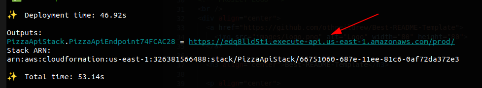

Pizza Request Machine State

Descripción.
This is a simple app to the basic elements for using the CDK framework.

the order of the exercise can be found in [here..](https://github.com/cdk-patterns/serverless/blob/main/the-state-machine/README.md).

## Instalation:

Steps.

- create a new directory with the name you want Ej.
  ```
  mkdir pizzatask
  ```

- get into the directory you made
  ```
  cd pizzatask
  ```

- now lets create the aws user to peform the deploy of the application (if you have one already, you can skip this step)
if you want to know to create the user in the Amazon console.. plese fallow this [link](https://docs.aws.amazon.com/IAM/latest/UserGuide/id_users_create.html)

- now it is time to configure the user... Run this command, and follow the instrucctions (if you already did this and create a profile, you can skip this step)
  ```
  aws configure --profile [name-of-the-profile-you-want-have]
  ```

- you can test the configuration of your aws profile with this command..
  ```
  aws sts get-caller-identity --profile [name-of-the-profile-you-created-before]
  ```

- now lets  install the cdk framework (if you already have the cdk installed globaly in your computer then you can skip this step )
  ```
  npm install -g aws-cdk
  ```

- check the installation of the CDK was successful
  ```
  cdk --version
  ```
you sould see something like this... 
2.99.1 (build b2a895e)

- now you are inside of the folder you created at the begining ... lets clone de repository to download the code base of the application
  ```
  git clone https://github.com/entenza1981/pizza-request-state-machine
  ```

- now lets install the npm dependencies..
  ```
  npm install
  ```

- run the test to check if everything is ok
  ```
  npm run test  
  ```

- now lets bootstrap the cdk (this is for the CDK may know the configuration of you amazon user and know where to deploy your app)
  ```
  cdk bootstrap --profile [name-of-the-profile-you-created-before]
  ```

- now is time to synth the app.for this run this command.
  ```
  cdk synth
  ```

- and lets deploy in the aws cloude all the staks of the application
  ```
  cdk deploy --profile [name-of-the-profile-you-created-before] --all
  ```

You my need to type 'y' at some point in the deploitment in order to proceed and finish with it.. 

and at the end of the process you will see a url (link) you will copy the url.. and you will add the word "pizza" as the following example

```
https://o8f1j3f9o4.execute-api.us-east-1.amazonaws.com/prod/pizza
```
<div align="center">
  <a href="https://github.com/othneildrew/Best-README-Template">
    
  </a>
</div>

As is shown in the order of the exercise .. you will perform a post request.. with a request body like this one.
```
{
    "flavour": "pineapple"
}
```
